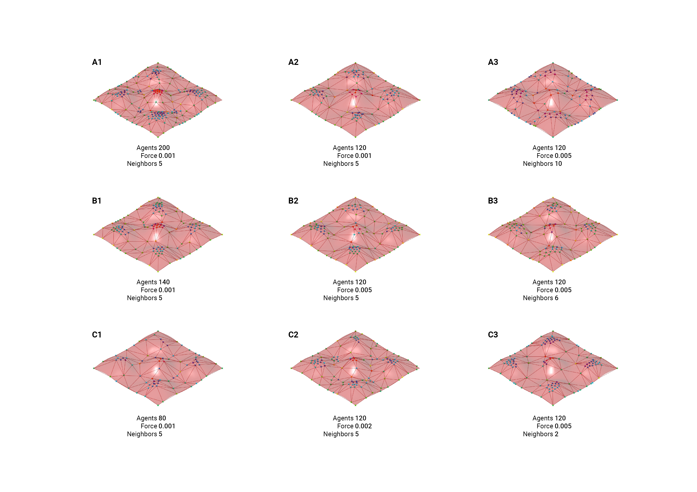

# Assignment 4: Agent-Based Model Documentation

## Table of Contents

- [Pseudo-Code](#pseudo-code)
- [Technical Explanation](#technical-explanation)
- [Design Variations](#design-variations)
- [Challenges and Solutions](#challenges-and-solutions)
- [References](#references)

---

## Pseudo-Code

### AGENT BUILDER and SIMULATOR:

1. **Main Simulation Loop**

   - **Initialize Agents**:
     - **Use the MyComponent class**:
         - Use build_agents(surface, n_agents) to create agents with random positions on the surface.
   - **Run simulation**:
     - For each time step:
       - **Agent Interactions**:
         - Each agent calculates separation forces based on a specified number of nearest neighbors.
       - **Agent Movement**:
         - Agents update their positions based on their velocities.
       - **Agent State Updates**:
         - Update agents’ curvature values using their new positions.
       - **Data Collection**:
         - Record agent positions, velocities, and curvatures for visualization.

2. **Agent Class**

   - **Attributes**:
     - position: The agent's UV position on the surface.
     - velocity: The agent's velocity vector.
     - local_curvature: The surface's curvature at the agent's position.

   - **Methods**:
     - **interact(agents)**:
       - Calculates separation forces based on the distance and curvature of the agent neighbors.
     - **move()**:
       - Update the agent’s position based on velocity vector and ensure its not out of bounds.
     - **update()**:
       - Recalculate the curvature based on the agents updated position on the surface.

3. **Grasshopper Component (MyComponent)**
   - **Attributes**:
     - Agents: Stores the list og agents created by the component.
   - **Methods**:
     - Input: Takes Rhino surface (srf) and the number of agents (N)
     - Process: Calls build_agents to create and store the agents
     - Output: returns the list of agents for use in the AGENT SIMULATOR

---

## Technical Explanation

- **Object-Oriented Design**

  **Agent class:** 
  - Represents individual agents interacting on the surface
  - Encapsulates the agents properties, like position, velocity, and local curvature
  - Implements methods like 'seperation' for interaction abd 'update' for state recalculation
**MyComponent class:** 
  - Acts as the simulator controller
  - Manages the initialization of the agents using build_agents, passing surface and count parameters
  - Controls agent behaviours and gather outputs for visualization

**OOP Principles**
  - Polymorphism: If the simulation were to include different types of agents with unique behaviours, polymorphism could be used to allow these variations
  - Modularity and reusability: by using the agent class, the simulation is modular in terms of different surfaces, agetn counts and interaction parameters

**Agent-Based Modeling**
  - Agent behavior: Each agent moves based on a seperation force algorythm, and thereby avoids overcrowding
  - Emergent patterns: By iterating agent interactions over time, emergent structural patterns are generated
  - Vector math: Agent movements and velocities are based on vectors
  - Surface curvature: Agents update their local curvature by analysing the local surface geomitry
  - Iterative: the system is updating with a time stepped loop controlled in Grasshopper, updating agent positions 

- **Visualization**
  - By using the outputs from the simulation, vecors can be made in grasshopper to visualize the movements of the agents along the surface.
  - The curvature of the surface by the point is visualized with a color gradient applied to the agents themselves.
  - Lines are generated in a triangulation manner between agents/points, to illustrate how the agents could potentially be used to make a truss like surface, with the agents acting as connection points for the trusses.

---

## Design Variations

*(Include images and descriptions of your generated design variations. For each variation, discuss the parameters or rules changed and the impact on the resulting patterns.)*

### Catalogue with 9 parametric variasions

   

   - **Parameters Changed**:
     - cohesion_factor: [Value]
     - separation_distance: [Value]
   - **Description**:
     - Discuss the observed changes in the model.

1. **B2**

   - **Parameters Changed**:
     - Agents: [120]
     - Force: [0.005]
     - Neighbors: [5]
   - **Description**:
     - Agents mostly meet at peaks. Triangular patterns form when neighbors get into close proximity

1. **A2**

   - **Parameters Changed**:
     - Agents: [120]
     - Force: [0.001]
     - Neighbors: [5]
   - **Description**:
     - Neighbors can get closer to each other (compared to B2) as they have a lower repending force

1. **C3**

   - **Parameters Changed**:
     - Agents: [120]
     - Force: [0.005]
     - Neighbors: [2]
   - **Description**:
     -  Agents mostly meet at peaks. Triangular patterns form when neighbors get into close proximity. Not much difference between this and B2

1. **A1**

   - **Parameters Changed**:
     - Agents: [200]
     - Force: [0.001]
     - Neighbors: [5]
   - **Description**:
     - A higher agent count causes a higher resolution triangulated pattern

---

## References

- **Agent-Based Modeling**

  - [Mesa: Agent-Based Modeling in Python](https://mesa.readthedocs.io/en/master/)

---